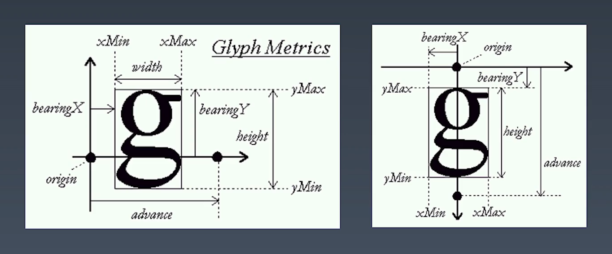
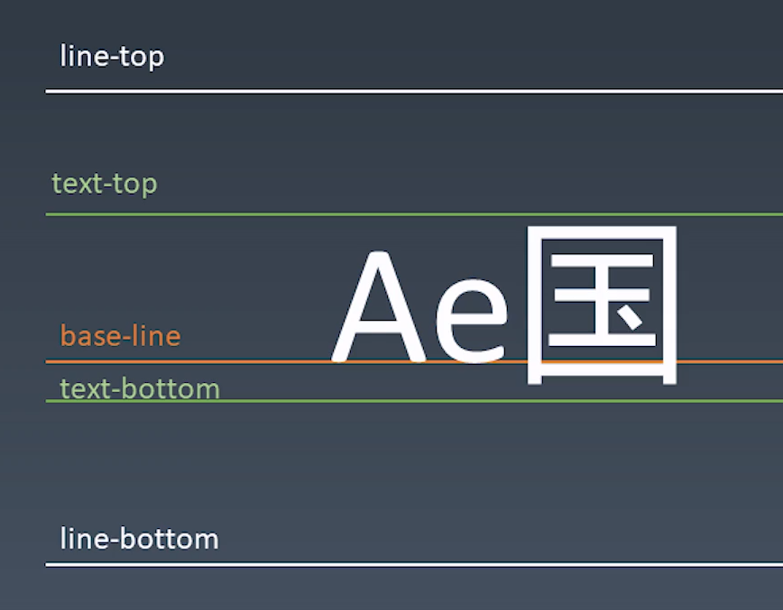
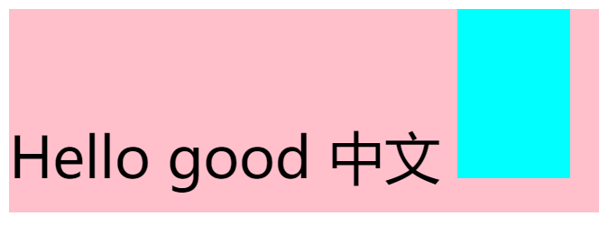
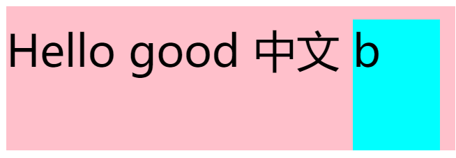
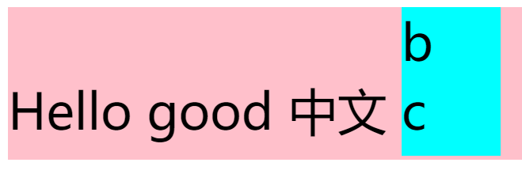

学习笔记

# CSS排版

## 盒模型

三个比较容易混淆的概念，填空
```
A. 标签 - Tag     - 源代码
B. 元素 - Element - 语义
C. 盒   - Box     - 表现

1. HTML代码中可以书写开始____，结束____，和自封闭____。

2. 一对起止____，表示一个____。

3. DOM树中存储的是____和其他类型的节点（Node)。

4. CSS选择器选中的是____。

5. CSS选择器选中的____，在排版时可能产生多个____。

6. 排版和渲染的基本单位是____。
```

我的答案：
```
HTML代码中可以书写开始_标签_ ，结束_标签_，和自封闭_标签_

一对起止_标签_ ，表示一个_元素_ 。

DOM树中存储的是_元素_和其它类型的节点（Node）。

CSS选择器选中的是_元素_ 。

CSS选择器选中的_元素_ ，在排版时可能产生多个_盒_ 。

排版和渲染的基本单位是_盒_ 。
```

**DOM树中存储的是Node，元素是节点的一种**  

**元素可能产生多个盒**，如inline在分行的时候会产生多个盒，还比如伪元素。  

盒模型  
```
  ┌┄┄┄┄┄┄┄┄┄┄┄┄┄┄┄┄┄┄┄┄┄┄┄┄┄┄┄┄┄┄┄┄┄┄┄┄┄┄┄┄┄┄┄┄┄┄┄┄┄┄┄┄┄┄┄┄┄┄┐
  ┆ margin                                                   ┆
  ┆                                                          ┆
  ┆       ┏━━━━━━━━━━━━━━━━━━━━━━━━━━━━━━━━━━━━━━━━━┓        ┆
  ┆       ┃ padding                                 ┃        ┆
  ┆       ┃                                         ┃<-border┆
  ┆       ┃        ┌┄┄┄┄┄┄┄┄┄┄┄┄┄┄┄┄┄┄┄┄┄┄┄┐        ┃        ┆
  ┆       ┃        ┆        content        ┆        ┃        ┆
  ┆       ┃        └┄┄┄┄┄┄┄┄┄┄┄┄┄┄┄┄┄┄┄┄┄┄┄┘        ┃        ┆
  ┆       ┃        └───────────v───────────┘        ┃        ┆
  ┆       ┃           content-box: width            ┃        ┆
  ┆       ┗━━━━━━━━━━━━━━━━━━━━━━━━━━━━━━━━━━━━━━━━━┛        ┆
  ┆       └────────────────────v────────────────────┘        ┆
  ┆                    border-box: width                     ┆
  ┆                                                          ┆
  └┄┄┄┄┄┄┄┄┄┄┄┄┄┄┄┄┄┄┄┄┄┄┄┄┄┄┄┄┄┄┄┄┄┄┄┄┄┄┄┄┄┄┄┄┄┄┄┄┄┄┄┄┄┄┄┄┄┄┘
```
box-sizing: content-box / border-box;

## 正常流

CSS排版基于三种流：
- 1代，正常流
- **2代，flex布局 <- 当前主流**
- 3代，grid排版
- 3.5代，CSS Houdini带来的完全自由，可以拿JS干预的排版

> 正常流能力最差、机制很复杂。

排版，只排**字**和**盒**

**如何写字？**
- 从左向右书写
- 同一行写的文字都是对齐的
- 一行写满了，就换到下一行

以上书写文字的方式，就是**正常流**的逻辑

> 最早排版思路都是文字工作者来做的，所以是基于排版专业知识去做的

### 正常流排版
- 收集盒进行(Row)
- 计算盒在行中的排布
- 计算行的排布

#### 概念：
- 一行中的盒，叫做 *行内盒(inline-box)*  
  准确的说，叫 *行内级别的盒(inline-level-box)*  

- 单独占一行的级别，被称作 *块级盒(block-level-box)*  

- 文字和inline-level-box排出来的盒，叫 *行盒(line-box)*  

行内盒排版示意（从左到右）：  
 `[inline-box] [inline-box] ...` ← 一个`[line-box]`  

块级盒排版示意（从上到下）：
```
[line-box]
[block-level-box]
[block-level-box]
```

**块级排版内容** 被称为 **BFC**(block-level-formatting-context)  
**行内排版内容** 被称为 **IFC**(inline-level-formatting-context)  

#### 正常流 - 行级排布

全世界各国文字，都按照 **基线(baseline)** 对齐
每种文字的基线都是不一样的

##### Text
文字字母的样式是由字体来决定的

英文字母描述的方法：


中英文混排的5条主要基线：


**text-top** 和 **text-bottom** 由字体（同一大小字体中，最大的）决定

混排中，容易出现行内不对齐的情况
```
<div style="font-size: 50px; line-height: 100px; background-color: pink;">
  <span>Hello good 中文</span>
  <div style="line-height: 70px; width: 100px; height: 150px; background-color: aqua; display: inline-block;"></div>
</div>
```
效果为：  
  
默认基线对齐，使用盒的 **下边缘去与基线对齐**   

在其中加文字，会发现基线就变了，变成了 **文字的基线** ：  
  

再加一行，就变成了 **最底下一行文字的基线** :  
  

结论： **行内盒的基线根据自己内部的内容变化，不建议使用基线对齐，建议使用vertical-align: top / bottom / middle**  

