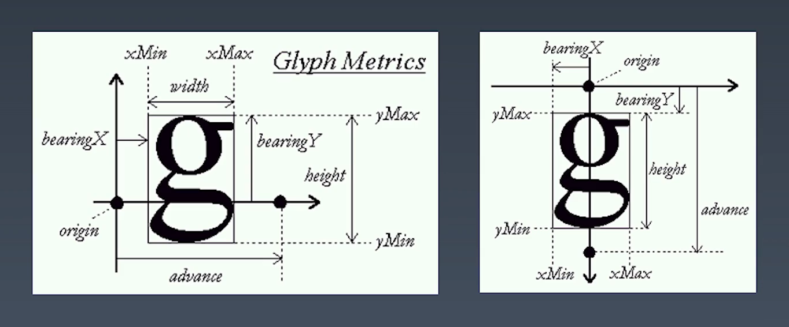
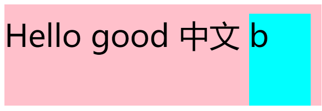
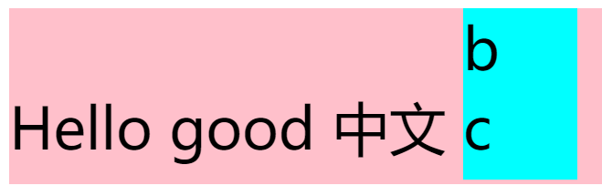
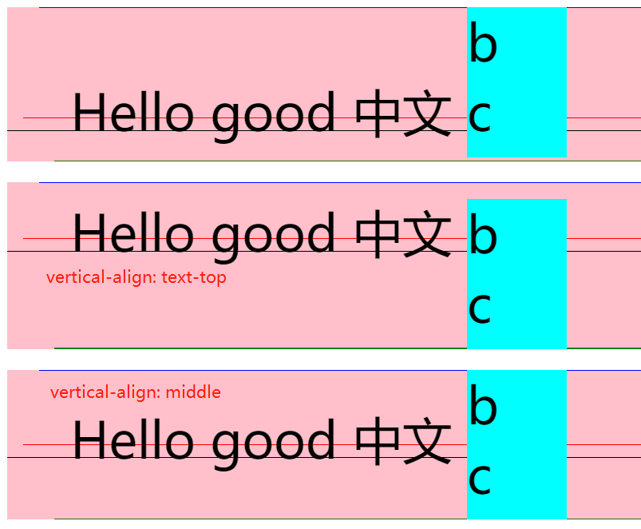
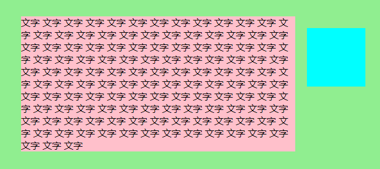
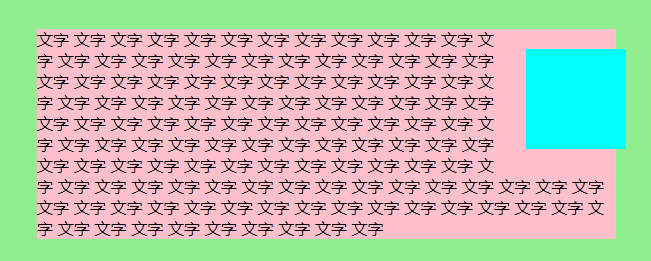
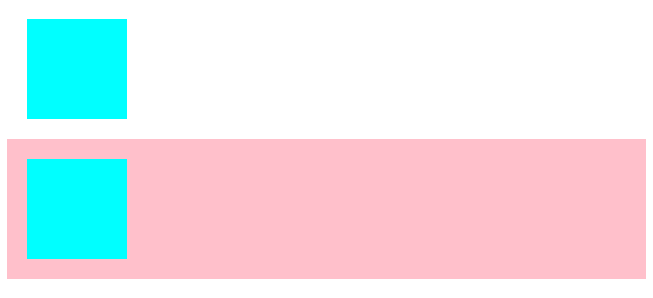
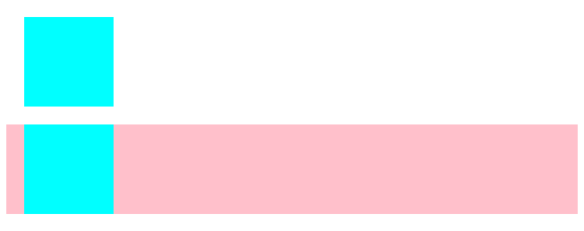

学习笔记

&emsp;
&emsp;
&emsp;
# CSS排版

## 盒模型

三个比较容易混淆的概念，填空
```
A. 标签 - Tag     - 源代码
B. 元素 - Element - 语义
C. 盒   - Box     - 表现

1. HTML代码中可以书写开始____，结束____，和自封闭____。

2. 一对起止____，表示一个____。

3. DOM树中存储的是____和其他类型的节点（Node)。

4. CSS选择器选中的是____。

5. CSS选择器选中的____，在排版时可能产生多个____。

6. 排版和渲染的基本单位是____。
```

我的答案：
```
HTML代码中可以书写开始_标签_ ，结束_标签_，和自封闭_标签_

一对起止_标签_ ，表示一个_元素_ 。

DOM树中存储的是_元素_和其它类型的节点（Node）。

CSS选择器选中的是_元素_ 。

CSS选择器选中的_元素_ ，在排版时可能产生多个_盒_ 。

排版和渲染的基本单位是_盒_ 。
```

**DOM树中存储的是Node，元素是节点的一种**  

**元素可能产生多个盒**，如inline在分行的时候会产生多个盒，还比如伪元素。  

盒模型  
```
  ┌┄┄┄┄┄┄┄┄┄┄┄┄┄┄┄┄┄┄┄┄┄┄┄┄┄┄┄┄┄┄┄┄┄┄┄┄┄┄┄┄┄┄┄┄┄┄┄┄┄┄┄┄┄┄┄┄┄┄┐
  ┆ margin                                                   ┆
  ┆                                                          ┆
  ┆       ┏━━━━━━━━━━━━━━━━━━━━━━━━━━━━━━━━━━━━━━━━━┓        ┆
  ┆       ┃ padding                                 ┃        ┆
  ┆       ┃                                         ┃<-border┆
  ┆       ┃        ┌┄┄┄┄┄┄┄┄┄┄┄┄┄┄┄┄┄┄┄┄┄┄┄┐        ┃        ┆
  ┆       ┃        ┆        content        ┆        ┃        ┆
  ┆       ┃        └┄┄┄┄┄┄┄┄┄┄┄┄┄┄┄┄┄┄┄┄┄┄┄┘        ┃        ┆
  ┆       ┃        └───────────v───────────┘        ┃        ┆
  ┆       ┃           content-box: width            ┃        ┆
  ┆       ┗━━━━━━━━━━━━━━━━━━━━━━━━━━━━━━━━━━━━━━━━━┛        ┆
  ┆       └────────────────────v────────────────────┘        ┆
  ┆                    border-box: width                     ┆
  ┆                                                          ┆
  └┄┄┄┄┄┄┄┄┄┄┄┄┄┄┄┄┄┄┄┄┄┄┄┄┄┄┄┄┄┄┄┄┄┄┄┄┄┄┄┄┄┄┄┄┄┄┄┄┄┄┄┄┄┄┄┄┄┄┘
```
box-sizing: content-box / border-box;

## 正常流

CSS排版基于三种流：
- 1代，正常流
- **2代，flex布局 <- 当前主流**
- 3代，grid排版
- 3.5代，CSS Houdini带来的完全自由，可以拿JS干预的排版

> 正常流能力最差、机制很复杂。

排版，只排**字**和**盒**

**如何写字？**
- 从左向右书写
- 同一行写的文字都是对齐的
- 一行写满了，就换到下一行

以上书写文字的方式，就是**正常流**的逻辑

> 最早排版思路都是文字工作者来做的，所以是基于排版专业知识去做的

### 正常流排版
- 收集盒进行(Row)
- 计算盒在行中的排布
- 计算行的排布

#### 概念：
- 一行中的盒，叫做 *行内盒(inline-box)*  
  准确的说，叫 *行内级别的盒(inline-level-box)*  

- 单独占一行的级别，被称作 *块级盒(block-level-box)*  

- 文字和inline-level-box排出来的盒，叫 *行盒(line-box)*  

行内盒排版示意（从左到右）：  
 `[inline-box] [inline-box] ...` ← 一个`[line-box]`  

块级盒排版示意（从上到下）：
```
[line-box]
[block-level-box]
[block-level-box]
```

**块级排版内容** 被称为 **BFC**(block-level-formatting-context)  
**行内排版内容** 被称为 **IFC**(inline-level-formatting-context)  

#### 正常流 - 行级排布

全世界各国文字，都按照 **基线(baseline)** 对齐
每种文字的基线都是不一样的

##### Text
文字字母的样式是由字体来决定的

英文字母描述的方法：  


中英文混排的5条主要基线：  


**text-top** 和 **text-bottom** 由字体（同一大小字体中，最大的）决定

混排中，容易出现行内不对齐的情况
```
<div style="font-size: 50px; line-height: 100px; background-color: pink;">
  <span>Hello good 中文</span>
  <div style="line-height: 70px; width: 100px; height: 150px; background-color: aqua; display: inline-block;"></div>
</div>
```
效果为：  
  
默认基线对齐，使用盒的 **下边缘去与基线对齐**   

在其中加文字，会发现基线就变了，变成了 **文字的基线** ：  
  

再加一行，就变成了 **最底下一行文字的基线** :  
  

结论： **行内盒的基线根据自己内部的内容变化，不建议使用基线对齐，建议使用vertical-align: text-top / text-bottom / middle**  
  


## 正常流块级排布

### 浮动
相当于先按普通流排版后，再向浮动方向推出去，然后重新计算当前行盒  

浮动会叠加，可通过clear设置强制换行  

> 因为正常流布局很困难，所以后来出现了只是用float来布局的一种模式  
因为float对象间的布局很像正常流  
可以满足一些人类直觉上的需求  
float不认br换行 -> 用clear属性来换行

### Margin-collapse
margin在盒模型中会发生堆叠，margin坍塌（margin collapse)，会使用最大margin作为留白  
注意： **margin-collapse只会发生在BFC中**  
注意2：**边距折叠(margin-collapse)取折叠的两个margin的最大值**  

## BFC合并

### Block
- Block Container:  里面有BFC的
  - 能容纳正常流的盒，里面就有BFC，想想有哪些？

- Block-level Box: 外面有BFC的

- Block Box = Block Container + Block-level Box:  里外都有BFC的  
  **重要，理解BFC合并的基础**

### Block Container
装BFC的容器  

> 基本上是一些display的效果  

- block
- inline-block
- table-cell  
  table-row里边要装table-cell，所以不是，但是table-cell是  
- flex item  
  flex本身不是，但是子元素flex-item，如果没有特殊指定，都是Block Container  
- grid cell  
- table-caption  

### Block-level Box

> 大多数display属性都有一对值，一个是Block level的，一个是inline level的

Block-level
- block
- flex
- table
- grid
- ...

Inline-level
- inline-block
- inline-flex
- inline-table
- inline-grid
- ...  

有一种非常**特殊**的display叫**run-in**  
跟着自己的上一个元素来  
虽然有，但是实际中不用  


### BFC
什么样的盒会创建BFC呢？
- floats  
  浮动元素里边会创建正常流  
- 绝对定位的元素  
- Block Containers但不是block-box的  
  - flex items
  - grid cell
  - ...

- 带有overflow不是visible的其他block-boxes

如何去记忆：  
默认能容纳正常流的盒，都认为他会创建BFC  
只有一种**例外：里外都是BFC，并且overflow是visible**

### BFC合并
发生在**里外都是BFC，并且overflow是visible**，即上述的例外  

#### 影响float

用来对比的图A，创建BFC，不合并的情况：  
  

将overflow设置为visible，BFC合并，效果：  
  

#### 边距折叠

还是上述情况的表现，`overflow`为`hidden`的时候，创建BFC，不合并:   
  

`overflow: visible`，合并BFC，边距折叠:  
  


## Flex排版  

### Flex排版逻辑
- 收集**盒**进**行**
- 计算盒在**主轴**方向的排布
- 计算盒在**交叉轴**方向的排布

### 分行
- 根据主轴尺寸，把元素分进行
- 若设置了no-wrap，则强行分配进第一行

### 计算主轴方向
- 找出所有flex元素  
  所有flex元素都是一个盒，宽度长度不固定而已  
- 把主轴剩余尺寸按比例分配给这些元素
- 如果剩余空间为负数，所有flex置为0，剩下的空间等比压缩

### 计算交叉轴方向
- 根据每一行中最大元素进行计算行高
- 根据行高、flex-align和item-align，确定元素的具体位置

&emsp;
&emsp;
&emsp;
# CSS动画与绘制

> CSS控制元素的位置表现，无非也就3类：
> - 控制元素的位置和尺寸信息
> - 绘制和渲染的信息
> - 交互与动画的信息

## @keyframes定义动画关键帧  
  - from、to，里边写declaration
  - 0%、100%，之间可以有无限多个关键帧

- animation使用定义的关键帧来形成动画

例：
```
@keyframes mykf {
  from { background: red; }
  to { background: yellow; }
}
div {
  animation: mykf 5s infinite;
}
```

## Animation
- animation-name 时间曲线（定义的关键帧）
- animation-duration 动画时长
- animation-timing-function 动画的时间曲线
- animation-delay 开始前延迟
- animation-iteration-count 播放动画的次数
- animation-direction 决定动画播放的方向

```
@keyframes mykf {
  0% {top: 0; transition: top easy;}
  50% {top: 30px; transition: top easy-in;}
  75% {top: 10px; transition: top easy-out;}
  100% {top: 0; transition: top linear;}
}
```
> **有一个小技巧**：可以使用`transition`来使用在一个动画中使用不同的时间曲线  
而不是整个动画都使用一个时间曲线，即`animation-timing-function`  


## Transition
- transition-property，即 *要变换的属性*
- transition-duration
- transition-timing-function
- transition-delay

## 时间曲线
> 三次贝塞尔曲线，表示虽时间前进，动画完成的进展的变化

## bezier拟合
> 贝赛尔曲线可以拟合直线和抛物线以及大量弧线

&emsp;
&emsp;
&emsp;
# 颜色

## CMYK  
使用补色的合成颜色法，使用品红、青色、黄色即CMY合成，  
但是由于黑色油墨便宜，所以添加了一个K的用来表示黑色的属性  
虽然有很多等价写法，但是基本上CMYK颜色都要最大程度的使用K值  
这是基于出版社印刷彩色图像时的一种配色方法  

## RGB
即使用三原色光合成颜色法  

## HSL 与 HSV
其中H和S都是比较固定的颜色  
Hue表示色相，把6种基本颜色拼成一个色盘  
Saturation表示纯度，S越高表示越接近纯色  
Value表示色值、明度，V越大颜色越接近纯色  
Lightness是从黑到白中间是纯色  

**HSL存在意义**，改变H值即可修改整体颜色

&emsp;
&emsp;
&emsp;
# 绘制

## 几何图形
- border
- box-shadow
- border-radius

## 文字
- font
  - glyph（字形），相当于矢量图  
- text-decoration

## 位图
-background-image

> 实际绘制时依赖底层图形库，在手机上依赖**skia**库，在PC上有一个**GDI**的版本  
> 在更底层是使用shader去绘制的  

### fragment-shader的定义：
- main函数
- 输入和输出
- 计算一个点的颜色

使用gpu平行运算，瞬间会执行很多次，把当前帧算出来

### 绘制图形
**不推荐使用border等奇技淫巧来绘制，效率低下，通用性差**  

官方推荐使用: `data uri` + `svg`去绘制

